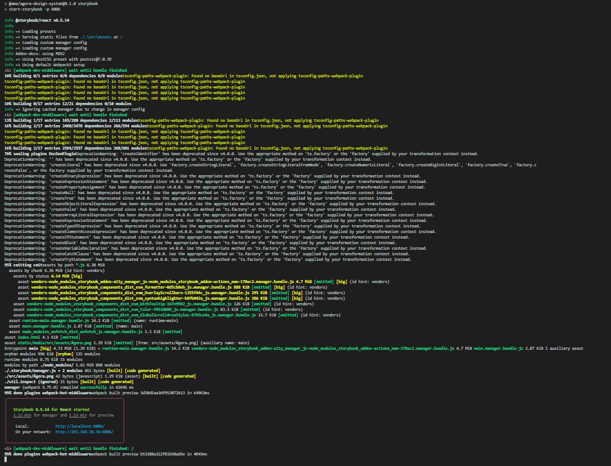
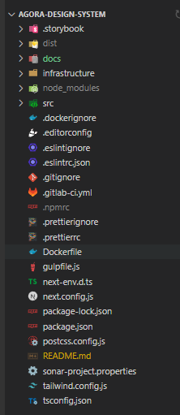
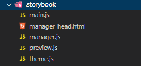
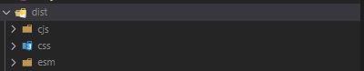
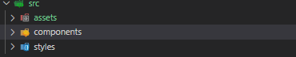
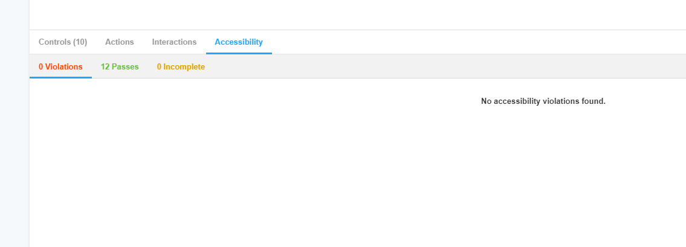

# Ágora Design System

<b>The main purpose of this Storybook is the development of a design system library with React Js and Next Js , accessible and easy to configure.</b>

## Core technologies

- React - version ^18.0.25 - <https://reactjs.org/>
- NextJs - version 13.0.4 - <https://nextjs.org/>
- Storybook - version ^6.5.13 - <https://storybook.js.org/docs/react/get-started/install>
- Tailwindcss - version ^3.2.4 - <https://tailwindcss.com/docs/installation>
- Radix-UI - <https://www.radix-ui.com/docs/primitives/overview/introduction>
- Node - version ^16

## Useful Links
- StoryBook Dev - <https://dev-apigw-pdun.northeurope.cloudapp.azure.com:8180/>
- Tailwind CSS Cheat Sheet - <https://tailwindcomponents.com/cheatsheet/>
- Sonnar - <https://ticappsonar.northeurope.cloudapp.azure.com/sonarqube/dashboard?id=portal-unico-storybook-agora>
- Nexus - <https://ticappsonar.northeurope.cloudapp.azure.com/nexus/#browse/browse:npm-general:%40ama%2Fagora-design-system>
- Figma (UX Design) - <https://www.figma.com/files/project/60863393/Ágora-Design-System>
- ZeroHeight - <https://zeroheight.com/1be481dc2/p/2861fa-boas-vindas>
- AccessMonitor (Acessibilidade AMA) - <https://accessmonitor.acessibilidade.gov.pt/>
- W3Validator - <https://validator.w3.org/nu/>
- Axe DevTools - <https://chrome.google.com/webstore/detail/axe-devtools-web-accessib/lhdoppojpmngadmnindnejefpokejbdd?utm_source=deque.com&utm_medium=referral&utm_campaign=axe_hero>

## Installation and start project

```sh
> npm install
> npm run storybook

```

This will generate logs like in the screenshot and locally launch the application



## Build project

Generating the project build helps us to understand if everything is ok and ready to a production environment. It is recommended to use this each time a component is terminated.

```sh
  > npm run build-storybook

```

## Format all files with Prettier config

To keep code and commits easy to read a custom config was made to format files to everyone on the same way. We can force this format running. The formatter runs on every file and fix them.

```sh
  > npm run format

```

## Check Lint and Lint fix

Using this to runs ESLint and find problems with syntax. Some we can fix with lint-fix. Others we have to make some changes.

```sh
  > npm run lint
  > npm run lint-fix

```

<b>NOTE: Both (Build and Lint commands) help to ensure Sonnar scan to run smoothly.</b>


## Project Structure



### __Folder _.storybook___


- _mains.js_ - the main reason to edit this file are to add new addons to storybook, order stories folders and add new static dirs.

- _manager-head.html_ - configure favicon of storybook app

- _manager.js_ - call our custom theme

- _preview.js_ - configure and call theme and other configurations of storybook

- _theme.js_ - custom theme, allow change logos, fonts, url of logos, etc.


### __Folder _dist___



When run the command bellow this will generate the folders above. This folder contains building files to our future lib. We can run this to check structure but this isn't used on development only when we publish.

```sh
  > npm run build

```

### __Folder _docs___

Contains assets to support this README file.

### __Folder _infractructure___
Contain file for Apache configuration.


### __Folder _src___


- _assets_ folder contains all images needed to our storybook or for some component to use. Divided on two folders:
  - ___storybook___ - all images/files related with environment of storybook app
  - ___app___ - all images/files related with components development

- _components_ folder contain main content, divided on:
  - ___documentation___ contain a story mdx file used on welcome page
  - ___ui___  contain components development and files to export component and their props.

          Folder structure:
            - Folder with the name of the component, when the name is composed use "-". Ex: name-othername
              - Scss file. Ex: name-othername.scss
              - Docs stories used to document use and what component used for. Use existing component has template. Ex: name-othername.stories.mdx
              - Stories tsx used to appear on storybook the component with controls and args Ex: name-othername.stories.tsx
              - Component Ex: name-othername.tsx. In this file couldn't exist any hardcoded string and the more props the better.
              - index to export component and props

        NOTE: Others folders can be added, like hooks, libs, utils, etc. Not forget to reference them to be exported.
  - ___styles___ contain a file used to global css of storybook

### __Tailwind.config.js__ file

File support all configurations to scss based on Figma and can be written with more or edited.


## Scss pattern

Each component start with a class named "agora-namecomponent". Try used most classes of tailwindcss and only when it's very specific use file scss of component.


## Accessibility

When developing a component or using an external one, accessibility is an important topic to look out for. All components has to be tested on W3c, AccessMonitor and Axe. Storybook has plugin installed that gives info of that too.




## Sonnar

- This project is connected to Sonnar, that analyzed quality code and report them. If Sonnar find something wrong the pipeline fails. Fix Sonnar error are __mandatory__ to build a new image.

## Git Flow Development -> Merge Request -> Review -> Approve -> Merge

The pattern of development:
  - Create a feature with a suggestive name or if exist the number and name of Jira ticket
  - When finish development open Merge Request(MR) with a sugestive name (Atencion that last comment commit normaly used as name, but not always is suggestive) and a description of what was develop and if any question/explication of some part of code. Assign this to a Reviewer.
  - Then some comments could be made on this MR on Review stage. This threads should only be closed by Reviewers, but can be reply for everyone.
  - If all good to go will be approve, when all reviewers approve the last one Merge that to develop

## Update dev environment of Storybook

Reviewers when requested can deploy new version. This only need new code on develop and use CI/CD app.

## Prepare code to generate new version Lib

Change package.json version, commit to develop then merge to master. This active pipeline that publish lib on nexus. See gitlab-ci.yml to more info.

## Use Lib

Is required to have user account on AMA Nexus to install this lib. Need to create a .npmrc file with registry and account settings.

```sh
  > npm install @ama/agora-design-system

```

This lib should be used on a Next App with this config on next.config.js
```sh
const withTM = require('next-transpile-modules')(['@ama/agora-design-system', '@babel/preset-react']);

module.exports = 
  withTM({
    optimizeFonts: false,
    i18n: {
      locales: ['pt'],
      defaultLocale: 'pt'
    },

    images: {
      disableStaticImages: true
    },

    devIndicators: {
      buildActivity: false
    },

    output: 'standalone',

    webpack(config) {
      config.module.rules.push(
        {
          test: [/\.ts(x)?$/, /\.js(x)?$/],
          use: [
            {
              loader: 'babel-loader',
              options: {
                presets: ['@babel/preset-env', '@babel/preset-react', '@babel/preset-typescript']
              }
            }
          ],
          exclude: /node_modules/
        },

        {
          test: [/\.bmp$/, /\.gif$/, /\.jpe?g$/, /\.png$/],
          loader: require.resolve('url-loader')
        },
        {
          test: /\.js.map$/,
          enforce: 'pre',
          use: ['source-map-loader']
        },
        {
          test: /\.map$/i,
          use: 'raw-loader'
        }
      );
      return config;
    }
  })
;

```
